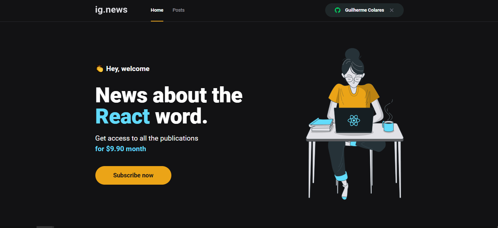
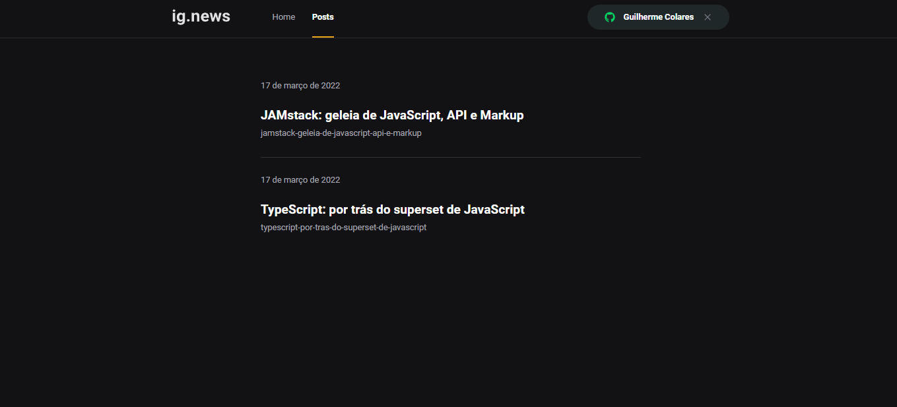
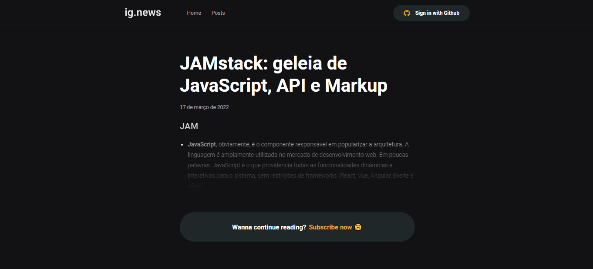

# Ignews

Projeto feito atráves de React com o objetivo de estudar as seguintes tecnologias: 

- Reactjs
- Nextjs
- Sass
- SSG (Static Site Generation) e SSR (Server Side Rendering)
- Autenticação com Github
- FaunaDB (Banco de dados)
- Prismic (CMS)

